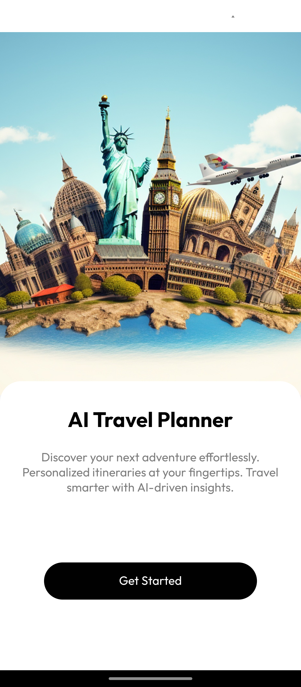
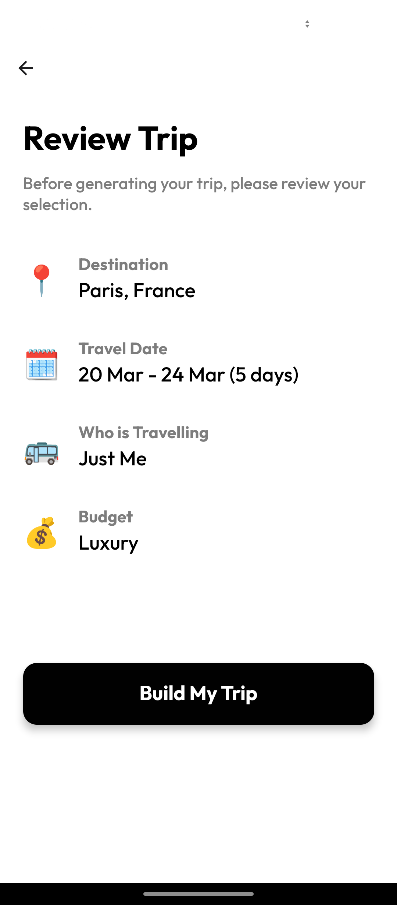

# 🤖 AI Travel Planner

## Overview

AI Travel Planner is a smart travel assistant designed for Android using Expo. The app utilizes Firebase for authentication and cloud storage while integrating the powerful Gemini Pro 2.0 model to generate AI-driven travel plans tailored to user preferences.

## Features

- **AI-Powered Trip Planning**: Generates customized itineraries using Gemini Pro 2.0.
- **Firebase Authentication**: Secure user authentication with Firebase.
- **Cloud Storage**: Stores user profiles and travel plans using Firebase Cloud Storage.
- **Intuitive UI**: Built with React Native and Expo for a seamless mobile experience.
- **Personalized Recommendations**: Users can specify preferences such as budget, destinations, and interests.

## Tech Stack

- **Frontend**: React Native, Expo
- **Backend**: Firebase Authentication, Firebase Cloud Storage
- **AI Model**: Gemini Pro 2.0
- **State Management**: Redux (if applicable)

## Installation

### Prerequisites

- Install **Node.js** & npm/yarn
- Install **Expo CLI** globally
- Set up a **Firebase project** with authentication and cloud storage enabled

### Steps

1. Clone the repository:
   ```sh
   git clone https://github.com/shubhamchimkar/ai-travel-planner-app.git
   cd ai-travel-planner-app
   ```
2. Install dependencies:
   ```sh
   npm install  # or yarn install
   ```
3. Configure APIS:
   - Create a `env` file and add Firebase credentials:
     ```env
     EXPO_PUBLIC_GOOGLE_MAP_KEY=yourgoogleplacesapi
     EXPO_PUBLIC_GOOGLE_GEMINI_API_KEY=yourgooglegemeiniapi
     ```
4. Configure Firebase:

   - Edit `FirebaseConfig.js` file and add Firebase credentials:
     ```env
     apiKey: process.env.FIREBASE_API_KEY,
     authDomain: process.env.FIREBASE_AUTH_DOMAIN,
     projectId: process.env.FIREBASE_PROJECT_ID,
     storageBucket: process.env.FIREBASE_STORAGE_BUCKET,
     messagingSenderId: process.env.FIREBASE_MESSAGING_SENDER_ID,
     appId: process.env.FIREBASE_APP_ID,
     measurementId: process.env.FIREBASE_MEASUREMENT_ID
     ```

5. Start the app:
   ```sh
   expo start
   ```

## Usage

1. Sign up or log in using Firebase Authentication.
2. Enter travel details such as destination, budget, and interests.
3. The AI generates an optimized travel itinerary.
4. Save, edit, or share the plan as needed.

## Deployment

The app is deployed on Expo. Try it out here: [AI Travel Planner on Expo](https://expo.dev/preview/update?message=AI%20Travel%20Planner&updateRuntimeVersion=1.0.0&createdAt=2025-03-02T14%3A38%3A54.969Z&slug=exp&projectId=ed2ca085-88d4-456d-b273-d3f6328bed51&group=12807821-5b17-407a-9eba-58a420119579)

## Screenshots

Here are some preview images of the app in action:

<p align="center">
  
  
  
  
  
  
  <br>
  
  
  
  
  
  
  <br>
  
  
</p>

## Contributing

We welcome contributions! Feel free to fork the repo, create a feature branch, and submit a pull request.

## Contact

For inquiries or feedback, reach out via [LinkedIn](https://www.linkedin.com/in/shubham-chimkar/).
